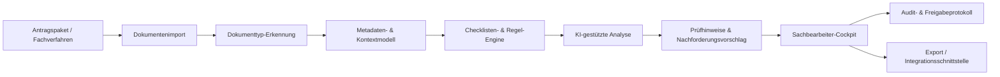
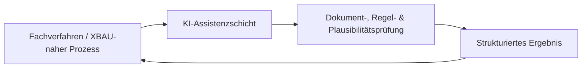

# GovTech Bauantrag KI BW – Project Showcase

> Private source repository · Public architecture, product & AI showcase

## Kurzfassung

**GovTech Bauantrag KI BW** ist ein Konzept- und Entwicklungsprojekt für eine **KI-gestützte Assistenz- und Qualitätssicherungsschicht in XBAU-nahen Bauantragsprozessen**.

Das Projekt ist ausdrücklich **kein automatisches Genehmigungssystem**. Ziel ist eine Assistenzlösung, die Dokumente, strukturierte Falldaten, Checklisten und Regeln verarbeitet und daraus nachvollziehbare Prüfhinweise für Sachbearbeitende erzeugt.

Der vollständige Arbeitsstand bleibt privat. Dieses Repository zeigt Produktlogik, Systemarchitektur, Datenfluss und die Rolle von KI im Gesamtsystem.

---

## Problemstellung

Bauantragsprozesse enthalten viele wiederkehrende Prüfaufgaben:

- Sind alle erforderlichen Unterlagen vorhanden?
- Sind Pflichtfelder ausgefüllt?
- Widersprechen sich Formular, Baubeschreibung und Pläne?
- Sind Flächen, Geschosszahl oder andere Angaben konsistent?
- Welche Unterlagen müssen nachgefordert werden?

Ein großer Teil dieser frühen Prüfungen ist standardisierbar, während die finale fachliche und rechtliche Entscheidung beim Menschen bleiben muss.

---

## Produktthese

Die Lösung positioniert KI nicht als Entscheider, sondern als **Assistenzschicht**.

### Grundsätze
- Human in the loop
- Nachvollziehbarkeit vor Vollautomatisierung
- Datenminimierung
- modulare Integration
- klare Trennung zwischen Prüfhinweis und Entscheidung
- Unsicherheit sichtbar machen statt überversprechen

---

## Zielbild

Die technische Zielarchitektur verarbeitet:

- Bauantragsunterlagen
- strukturierte Metadaten
- Checklisten
- Prüfregeln
- Kontextinformationen

und erzeugt daraus:

- Vollständigkeitshinweise
- Inhaltsauffälligkeiten
- Widerspruchshinweise
- Plausibilitätswarnungen
- Nachforderungsvorschläge

Die finale Bewertung bleibt bei Sachbearbeitenden.

---

## Kernkomponenten

Die konzipierte Architektur besteht aus folgenden Modulen:

1. Dokumentenimport
2. Dokumenttyp-Erkennung
3. Metadaten- und Kontextmodell
4. Checklisten-Engine
5. Regel- und Plausibilitäts-Engine
6. KI-gestützte Analyse
7. Nachforderungs-Generator
8. Sachbearbeiter-Oberfläche
9. Audit- und Freigabeprotokoll
10. Export- bzw. Integrationsschnittstelle

---

## Systemarchitektur



---

## MVP-Datenfluss

Der definierte MVP-Datenfluss ist:

1. Antragspaket oder Demo-Fall wird geladen
2. Dokumente werden erkannt und klassifiziert
3. strukturierte Falldaten werden erfasst oder simuliert
4. Checkliste und Regelbasis werden geladen
5. Dokumente, Inhalte und Anforderungen werden abgeglichen
6. KI erzeugt Hinweise zu Vollständigkeit, Widersprüchen und Auffälligkeiten
7. Sachbearbeitende prüfen das Ergebnis
8. Freigaben und Änderungen werden protokolliert

---

## Späteres Integrationsziel



Das führende System bleibt das jeweilige Fachverfahren. Die KI-Assistenzschicht ergänzt bestehende Prozesse, statt sie zu ersetzen.

---

## Produktmodule

### 1. Dokumenten- und Anlagen-Erkennung
Erkennt, welche Dokumente und Anlagen eingereicht wurden.

### 2. Vollständigkeitsprüfung
Vergleicht eingereichte Unterlagen mit einer konfigurierbaren Checkliste.

### 3. Inhalts- und Plausibilitätsprüfung
Erkennt typische Auffälligkeiten, Widersprüche und unplausible Angaben zwischen Unterlagen.

### 4. XBAU-nahe Kontextauswertung
Verarbeitet strukturierte Prozess- und Antragsdaten, soweit sie verfügbar sind.

### 5. Nachforderungsassistent
Erzeugt strukturierte Vorschläge für Nachforderungsschreiben und Prüfhinweise.

### 6. Sachbearbeiter-Cockpit
Stellt Prüfungsergebnisse, Unsicherheiten, fehlende Unterlagen und Textvorschläge dar.

### 7. Audit- und Freigabeprotokoll
Dokumentiert erzeugte, bearbeitete und freigegebene Hinweise.

---

## MVP V1 – definierte Prüfungen

Für den MVP wurden zehn konkrete Prüfbereiche definiert:

1. Pflichtunterlagen je Verfahrenstyp
2. Pflichtfelder im Formular
3. Unterschriften und formale Bauvorlageberechtigung
4. Lesbarkeit, Benennung und technische Verwendbarkeit von Dokumenten
5. Konsistenz der Nutzung zwischen Formular, Beschreibung und Plan
6. Konsistenz von Geschosszahl, Gebäudehöhe, Dachform und Dachneigung
7. Konsistenz von Wohn- und Nutzflächen
8. Vorhandensein und Plausibilität eines Abstandflächen-Nachweises
9. Stellplatznachweis und einfache Satzungslogik
10. Markierung möglichen Abweichungs- oder Befreiungsbedarfs

---

## KI-Rolle im System

Die KI ist bewusst nur ein Teil des Gesamtsystems.

Sie soll insbesondere:
- Dokumentinhalte zusammenführen
- Auffälligkeiten erkennen
- Widersprüche benennen
- Hinweise erzeugen
- Nachforderungsvorschläge formulieren

Sie soll **nicht**:
- rechtsverbindlich entscheiden
- Baugenehmigungen automatisch erteilen oder verweigern
- menschliche Freigabe umgehen

Diese Trennung ist ein zentraler Architekturgrundsatz.

---

## Regelbasierte + KI-basierte Verarbeitung

Das Konzept setzt nicht ausschließlich auf ein Sprachmodell.

Stattdessen werden unterschiedliche Mechanismen kombiniert:

```text
Dokumente
   ↓
Dokumenterkennung
   ↓
strukturierter Kontext
   ↓
Checklisten + feste Regeln
   ↓
KI-Analyse
   ↓
nachvollziehbarer Prüfhinweis
   ↓
menschliche Freigabe
```

Damit sollen deterministische Prüfungen und flexible KI-Analyse sinnvoll zusammenspielen.

---

## Auditierbarkeit

Das Systemkonzept sieht ein Audit- und Freigabeprotokoll vor.

Dadurch soll nachvollziehbar bleiben:
- welcher Hinweis erzeugt wurde
- was verändert wurde
- was freigegeben wurde
- wo menschliche Entscheidungen eingegriffen haben

Dies ist insbesondere bei verwaltungsnahen KI-Anwendungen ein wichtiger Bestandteil des Zielbilds.

---

## Projektstruktur im privaten Repository

Das private Projekt ist nicht nur eine einzelne Idee, sondern in mehrere Arbeitsbereiche gegliedert:

```text
00_START_HERE/
01_STRATEGISCHE_NEUPOSITIONIERUNG/
02_XBAU_UND_DIGITALE_BAUGENEHMIGUNG/
03_BEHOERDEN_REALITAET/
04_PROBLEM_VALIDIERUNG/
05_MVP_XBAU_ASSISTENZ/
06_PRODUKT_UND_MODULE/
07_RECHT_DATENSCHUTZ_VERWALTUNG/
08_TECHNIK_ARCHITEKTUR/
09_PILOT_UND_GO_TO_MARKET/
10_PITCH_INVESTOR_BEHOERDE/
11_FINANZEN_GESCHAEFTSMODELL/
12_MEETINGS_UND_INTERVIEWS/
13_RECHERCHE_QUELLEN/
```

Das zeigt, dass das Projekt Produkt, Fachprozess, Technik, Validierung, Governance und wirtschaftliche Aspekte gemeinsam betrachtet.

---

## Produkt- und Entwicklungsarbeit

Im privaten Projekt existieren u. a.:

- MVP-Definition
- Demo-Fälle und Prüfmatrizen
- Dokumenteninhalte für Testszenarien
- Sachbearbeiter-Oberflächenkonzept
- Screenflow / Wireframes
- Produktmodule
- Roadmap
- technische Architektur
- Datenfluss
- Recht-/Datenschutzbetrachtung
- Pilot- und Go-to-Market-Überlegungen
- Recherchequellen

---

## Warum dieses Projekt technisch relevant ist

Das Projekt zeigt insbesondere:

- Übersetzung eines komplexen Fachprozesses in Systemkomponenten
- Denken in modularen Architekturen
- Datenfluss- und Integrationsdesign
- Kombination regelbasierter und KI-basierter Verarbeitung
- Human-in-the-loop-Design
- Auditierbarkeit
- Schnittstelle zwischen Fachbereich, IT und KI
- klare Systemgrenzen
- Umgang mit Unsicherheit und Verantwortlichkeit

---

## Bezug zu System Architecture / Data & AI

Für eine System-Architecture-/Data-&-AI-Rolle sind besonders relevant:

- Zerlegung eines komplexen Produkts in Komponenten
- Definition von Datenflüssen
- Trennung von führendem System und Assistenzsystem
- Integrationsschnittstellen
- Kontext- und Metadatenmodell
- Zusammenspiel von Regeln, Daten und KI
- Betriebs- und Governance-Aspekte
- fachliche Anforderungen in technische Lösungsbausteine übersetzen

Das Projekt befindet sich im Konzept-/Entwicklungsstadium und wird nicht als produktiv betriebenes Behördenverfahren dargestellt. Gerade diese klare Abgrenzung gehört zum Projektansatz.

---

## Status

Konzept- und Entwicklungsprojekt mit definiertem MVP, Produktmodulen, Datenfluss und Architekturzielbild.

## Hinweis

Dieses Repository dient ausschließlich als **technischer und konzeptioneller Showcase**.  
Interne Arbeitsunterlagen und vollständige Projektdokumentation bleiben privat.
